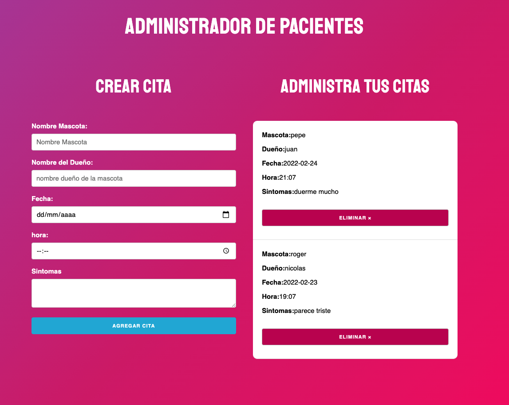

patient manager app made with React.

The form allows us to create an appointment. Contains the validations from the Front side. 
In the file we will see the appointments that were saved in Local Storage. We can also remove them.

tech: React.js, the styles made with skeleton.

🖖
